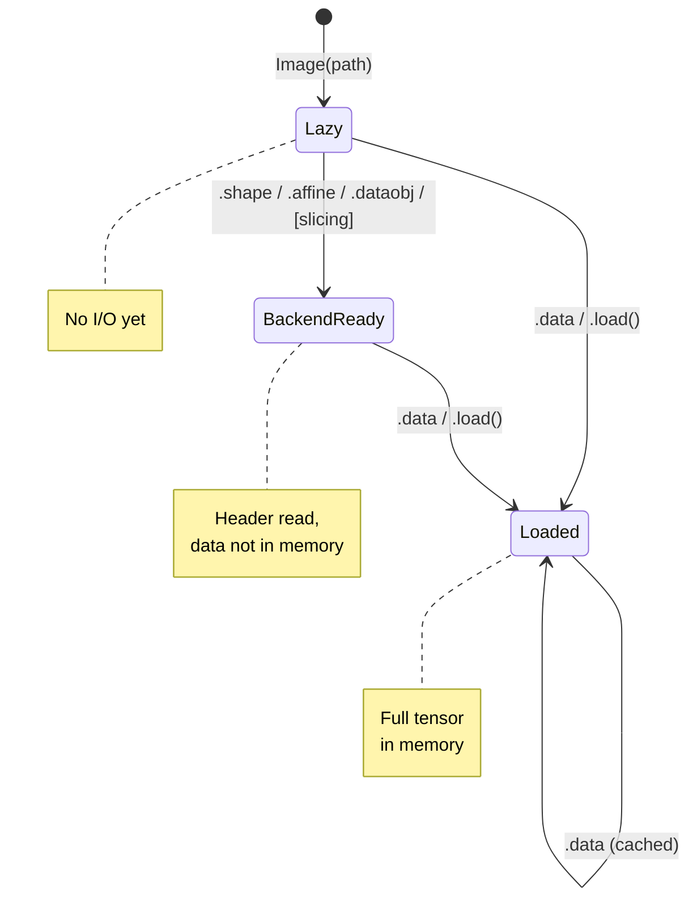

# Lazy loading and backends

TorchIO images are lazy by default: creating an `Image` from a file
path reads nothing from disk. This article explains when data actually
enters memory and how the backend system works.

## When is data loaded?



| Access | What happens |
|--------|-------------|
| `Image(path)` | Nothing. Stores the path. |
| `.shape` | Creates a backend and reads the header. No data loaded. |
| `.spacing`, `.affine` | Same: reads header via backend. |
| `image[slices]` | Reads only the sliced region through the backend. Parent image stays unloaded. |
| `.data` | Loads the full tensor into memory. Cached for subsequent access. |
| `.dataobj` | Returns the raw backend for advanced use. |

## Backends

A backend provides lazy access to image data without loading it all
into memory. TorchIO selects the backend based on the file extension:

| Backend | Format | How it works |
|---------|--------|-------------|
| `NibabelBackend` | `.nii`, `.nii.gz` | Wraps nibabel's `ArrayProxy`. Uncompressed files are memory-mapped; compressed files are decompressed on demand. |
| `ZarrBackend` | `.nii.zarr` | Wraps `niizarr.zarr2nii()`. Data is stored in independently compressed chunks. Only the chunks overlapping your slice are read. |
| `TensorBackend` | In-memory | Used for images created via `from_tensor()`. Wraps a PyTorch tensor directly (no numpy round-trip). |

For other formats (NRRD, MHA, etc.), there is no lazy backend. Shape
can still be read from the header via SimpleITK without loading data,
but slicing triggers a full load.

## Practical impact

Consider a 724 x 868 x 724 float32 MRI (~1.8 GB):

```python
image = tio.ScalarImage("huge_volume.nii.gz")

# Full load: ~45 seconds
mean_full = image.data[:, 100:110, 100:110, 100:110].mean()

# Lazy slice: ~0.1 seconds
image2 = tio.ScalarImage("huge_volume.nii.gz")
mean_lazy = image2[:, 100:110, 100:110, 100:110].data.mean()
```

The difference is ~450x because the lazy path:

1. Asks nibabel to decompress only the needed region
2. Allocates only a small float32 tensor (10 x 10 x 10)

The full-load path decompresses the entire file, allocates 1.8 GB,
copies it to a float32 tensor, and *then* slices.

## The `dataobj` property

For advanced use, `image.dataobj` gives direct access to the backend:

```python
backend = image.dataobj  # NibabelBackend, ZarrBackend, or TensorBackend
backend.shape             # (C, I, J, K)
backend.affine            # 4x4 float64 tensor
chunk = backend[:, 50:60, 50:60, 50:60]  # numpy array
```

This is useful when you need fine-grained control over what gets read,
or when you want to avoid even the overhead of creating a new `Image`
object.

## File format recommendations

| Use case | Recommended format |
|----------|--------------------|
| Local training with random access | Uncompressed `.nii` (memory-mapped) |
| Storage / archival | `.nii.gz` (compressed) |
| Very large volumes, remote storage | `.nii.zarr` (chunked) |
| Interop with non-NIfTI tools | `.nrrd`, `.mha` via SimpleITK |
