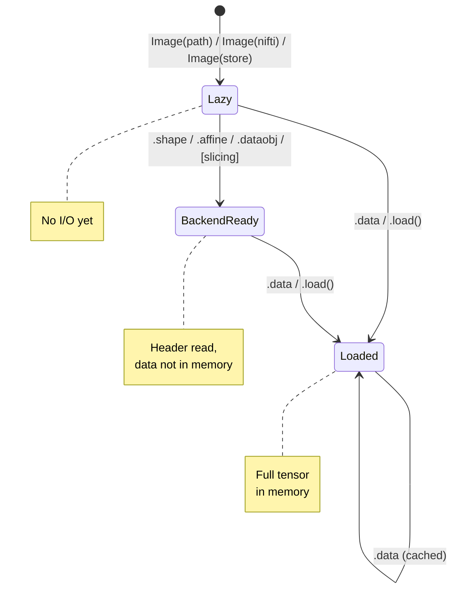

# Lazy loading and backends

TorchIO images are lazy by default: creating an `Image` from a file
path, a NiBabel image, or a zarr Store reads nothing from disk. This
article explains when data actually enters memory and how the backend
system works.

The backends are a lazy **I/O** layer, not a lazy *computation* framework.
They speed up metadata reads (shape, affine, dtype) and region slicing, but
they do not defer arithmetic or transforms. Once you access `.data`, apply a
transform, or build a batch, the full tensor is materialized in memory (see
[When tensors are materialized](#when-tensors-are-materialized)).

## When is data loaded?



| Access | What happens |
|--------|-------------|
| `Image(path)` | Nothing. Stores the path. |
| `Image(nifti_image)` | Nothing. Stores a reference to the nibabel object. |
| `Image(zarr_store)` | Nothing. Stores the store reference. |
| `Image(tensor)` | Immediate. The tensor is already in memory. |
| `.shape` | Creates a backend and reads the header. No data loaded. |
| `.spacing`, `.affine` | Same: reads header via backend. |
| `image[slices]` | Reads only the sliced region through the backend. Parent image stays unloaded. |
| `.data` | Loads the full tensor into memory. Cached for subsequent access. |
| `.dataobj` | Returns the raw backend for advanced use. |

## Backends

A **backend** is a lazy *I/O adapter*: an object that gives `Image` uniform
access to one image's data, wherever it lives, without loading the whole
volume. Intuitively, a backend is "a thing that can answer five questions",
which is exactly its contract:

- `shape` -> always `(C, I, J, K)`
- `affine` -> the 4x4 voxel-to-world matrix
- `dtype` -> the on-disk (or in-memory) data type
- `backend[region]` -> read *just* that region, as a 4D tensor
- `to_tensor()` -> materialize the whole volume

The first three are cheap header reads; the last two are where pixel data is
actually read. Each backend normalizes its storage-specific layout (e.g. a
NIfTI's `(I, J, K)` or `(I, J, K, C)`) into TorchIO's `(C, I, J, K)`.

Because "backend" is an overloaded word, it helps to say what this is **not**:

- **Not a compute backend**: it has nothing to do with `torch` devices or
  kernels.
- **Not the storage format itself**: it is the *adapter* to a format. Formats
  are mapped to backends by a resolver (below).
- **Not a lazy computation framework**: it defers *reads*, not arithmetic.
  Transforms, batching, and queues still materialize tensors (see
  [When tensors are materialized](#when-tensors-are-materialized)).

TorchIO does not hard-code the choice in `Image`: it passes a description of the
source (a `BackendRequest`) to a small **resolver**, which consults a registry
of backends in order and returns the first match:

| Backend | Format | How it works |
|---------|--------|-------------|
| `NibabelBackend` | `.nii`, `.nii.gz`, `nib.Nifti1Image` | Wraps nibabel's `ArrayProxy`. Uncompressed files are memory-mapped; compressed files are read through nibabel's proxy. Also used for NiBabel images passed directly to the constructor. |
| `ZarrBackend` | `.nii.zarr` | Wraps `niizarr.zarr2nii()`. Data is stored in independently compressed chunks. Only the chunks overlapping your slice are read. |
| `NibabelBackend` (via store) | `zarr.Store` | For zarr stores passed to the constructor, `zarr2nii(store)` is called on first access, producing a dask-backed nibabel image. Instantiation is O(1). |
| `TensorBackend` | In-memory | Used for images created from tensors or NumPy arrays. Wraps a PyTorch tensor directly (no numpy round-trip), preserving its device and dtype. |

For other formats (NRRD, MHA, etc.), there is no lazy backend. Shape
and dtype can still be read from the header via SimpleITK without loading
data, but slicing triggers a full load. You can teach TorchIO about new
formats without modifying `Image`; see
[Extending the backend system](#extending-the-backend-system).

## Practical impact

Slicing a lazy image instead of loading it whole avoids allocating and copying
the full tensor. For formats that support random access, it also avoids
reading most of the file. Consider reading a small patch from a large volume:

<!-- pytest-codeblocks:skip -->
```python
# Full load: reads and allocates the whole volume, then slices
mean_full = tio.ScalarImage("huge_volume.nii").data[:, 100:110, 100:110, 100:110].mean()

# Lazy slice: reads only the requested region
mean_lazy = tio.ScalarImage("huge_volume.nii")[:, 100:110, 100:110, 100:110].data.mean()
```

How much you gain depends strongly on the format:

- **`.nii` (uncompressed)** is memory-mapped, so the lazy path reads essentially
  only the requested bytes. This is true random access and is by far the
  fastest, often two orders of magnitude quicker for a small patch.
- **`.nii.zarr` (chunked)** reads only the chunks overlapping the patch, so it
  also scales well, especially for remote storage.
- **`.nii.gz` (compressed)** is the subtle case: gzip is a *stream* format, not
  a random-access one. To reach the requested region, nibabel must decompress
  the stream from the beginning, so the lazy path still does most of the
  decompression work. The speedup over a full load is real but modest: it
  comes mainly from skipping the full float32 allocation and copy, not from
  avoiding decompression.

At a glance:

| Format | Partial I/O | Notes |
|---|---|---|
| `.nii` | memory-mapped | true random access, by far the fastest |
| `.nii.zarr` | chunked | reads only overlapping chunks; great for remote storage |
| `.nii.gz` | streamed | gzip is *not* random access; modest speedup |

## When tensors are materialized

Laziness applies to *I/O*, not to computation. The full tensor is read into
memory the first time you do any of the following:

- access `.data` or call `.load()` (the result is then cached);
- apply a transform: transforms operate on materialized tensors;
- build a batch or collate subjects in a `DataLoader`;
- iterate a `Queue` or sampler, which materializes each sampled patch (a
  sampler may still use lazy slicing to read only that patch from disk);
- save the image, or call `.numpy()`.

In other words, lazy reads and slicing speed up *getting at a region of the
data*; they do not turn transforms or batching into deferred operations.

## The `dataobj` property

For advanced use, `image.dataobj` gives direct access to the backend:

<!-- pytest-codeblocks:skip -->
```python
backend = image.dataobj  # NibabelBackend, ZarrBackend, or TensorBackend
backend.shape             # (C, I, J, K)
backend.affine            # 4x4 float64 tensor
patch = backend[:, 50:60, 50:60, 50:60]  # torch.Tensor, shape (C, 10, 10, 10)
```

Backend slicing follows the same rules as `image[...]`: the result is always a
4D `(C, I, J, K)` `torch.Tensor`, and integer indices keep their axis (so
`backend[0]` has shape `(1, I, J, K)` rather than dropping the channel
dimension). For `TensorBackend`, the slice preserves the tensor's device and
dtype.

This is useful when you need fine-grained control over what gets read,
or when you want to avoid even the overhead of creating a new `Image`
object.

## Extending the backend system

!!! note "Advanced, rarely needed"

    Most users never touch this. The built-in backends already cover NIfTI,
    NIfTI-Zarr, zarr stores, NiBabel images, and in-memory tensors. Reach for a
    custom backend only when you need lazy access to a format TorchIO does not
    support out of the box.

Backend selection is driven by a registry, so you can support a new format
without editing `Image`. Register a *matcher* (which decides whether a
`BackendRequest` applies) and a *factory* (which builds the backend).

As a concrete example, here is a lazy backend for plain NumPy `.npy` volumes.
`np.load(..., mmap_mode="r")` memory-maps the file, so reading a small region
only touches the bytes you ask for, exactly like the built-in `.nii` path:

<!-- pytest-codeblocks:skip -->
```python
import numpy as np
import torch

from torchio.data import register_backend
from torchio.data.backends import BackendRequest, normalize_index


class NpyBackend:
    """Lazy, memory-mapped backend for single-channel ``.npy`` volumes."""

    def __init__(self, path):
        self._memmap = np.load(path, mmap_mode="r")  # shape (I, J, K), unread

    @property
    def shape(self):
        i, j, k = self._memmap.shape
        return (1, i, j, k)  # always (C, I, J, K)

    @property
    def affine(self):
        return torch.eye(4, dtype=torch.float64)  # unknown here: identity

    @property
    def dtype(self):
        return self._memmap.dtype

    def __getitem__(self, index):
        # normalize_index keeps the result 4D and never drops axes.
        sc, si, sj, sk = normalize_index(index)
        region = np.array(self._memmap[si, sj, sk])  # reads only this block
        return torch.from_numpy(region)[None][sc]  # add channel axis, then select

    def to_tensor(self):
        return torch.from_numpy(np.array(self._memmap))[None]


register_backend(
    "npy",
    lambda request: request.path is not None and request.path.suffix == ".npy",
    lambda request: NpyBackend(request.path),
)

# .npy files are now first-class and lazy:
image = tio.ScalarImage("volume.npy")
print(image.shape)                       # read from the header, no full load
patch = image[:, 10:20, 10:20, 10:20]    # reads just that block
```

A matcher can key off anything in the `BackendRequest` (the path, a zarr store,
the reader, and so on), and registered backends are consulted before the
built-ins, so you can also override a built-in for a given source.

Alternatively, if you already pass a custom `reader` to a specific image, make
it a lazy reader by implementing `create_backend` (see
[Use a custom reader](../how-to/custom-reader.md)). Simple readers that just
return `(tensor, affine)` keep working unchanged: they load eagerly.

## File format recommendations

| Use case | Recommended format |
|----------|--------------------|
| Local training with random access | Uncompressed `.nii` (memory-mapped) |
| Storage / archival | `.nii.gz` (compressed) |
| Very large volumes, remote storage | `.nii.zarr` (chunked) |
| Large-scale datasets (100k+ volumes) | `zarr.Store` objects (O(1) instantiation) |
| Interop with non-NIfTI tools | `.nrrd`, `.mha` via SimpleITK |
