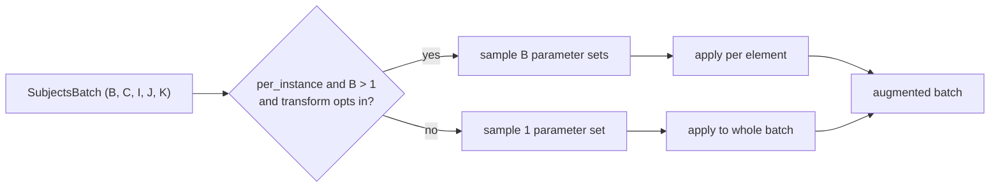

# Per-instance augmentation

When a transform runs on a batch, each element can receive its **own**
randomly sampled augmentation. This is the default behavior and mirrors
batched GPU augmentation libraries such as
[BatchAug](https://github.com/halleewong/batchaug) and
[Kornia](https://github.com/kornia/kornia).

## Why per-instance

Training augmentation works best when every sample in a mini-batch sees
a different perturbation. If a whole batch shared one rotation angle or
one noise level, the effective augmentation diversity per step would be
much lower. Sampling parameters independently per element restores that
diversity while keeping a single, vectorized call.

## How it works

TorchIO converts every input into a
`SubjectsBatch` of 5D tensors
`(B, C, I, J, K)`. A transform's
`make_params` step samples either one
parameter set (shared) or `B` independent sets (per-instance), and
`apply_transform` broadcasts or
loops over the batch dimension accordingly.



Per-instance sampling activates only for genuine batches
(`batch_size > 1`). A single
`Subject`, `Image`, or tensor always uses the
single-sample path, so existing single-subject code is unchanged.

## Controlling it

Every transform inherits a `per_instance` flag (default `True`). Set it
on the individual stochastic transform whose sampling you want to
control:

<!-- pytest-codeblocks:skip -->
```python
import torchio as tio

# Independent rotation per batch element (default)
augmented = tio.Affine(degrees=(0, 45))(batch)

# One rotation applied identically to the whole batch
augmented = tio.Affine(degrees=(0, 45), per_instance=False)(batch)
```

### Per-element probability

When a transform opts into per-element probability and its probability
`p` is below 1, each batch element is gated **independently**: some
elements receive the transform and others are left unchanged.

<!-- pytest-codeblocks:skip -->
```python
# About half of the batch elements get noise, sampled independently
augmented = tio.Noise(std=(0.05, 0.2), p=0.5)(batch)
```

Shape-changing transforms (for example a resampling target), and
transforms that have not opted into per-element probability, keep a
single batch-wide decision: masked and unmasked elements would
otherwise have incompatible shapes.

### Choosing a different transform per element

`OneOf` and `SomeOf` also branch per
element: each batch element independently chooses which transform (or
subset of transforms) to apply.

<!-- pytest-codeblocks:skip -->
```python
# Element 0 might be flipped while element 1 is blurred
augmented = tio.OneOf([tio.Flip(axes=(0,)), tio.Blur(std=(1, 3))])(batch)
```

Per-element selection requires shape- and schema-preserving transforms,
so the augmented elements can be re-stacked into one batch.

## History and inversion

Each element keeps its own sampled parameters in the transform history.
Calling `unbatch()` returns subjects that
each carry only their own history, and elements gated out by per-element
probability omit that transform entirely.

Invertible transforms invert each element with its own parameters.
After a per-element `OneOf`/`SomeOf`,
the batch is inverted element by element:

<!-- pytest-codeblocks:skip -->
```python
restored = augmented.apply_inverse_transform()
```

## Capability and roll-out

Per-instance support is advertised per transform through two
properties:

- `supports_per_instance_params`: the transform samples parameters
  independently per element.
- `supports_per_instance_p`: the transform gates each element
  independently with `p`.

Transforms that do not opt in (for example purely deterministic
preprocessing) keep batch-shared behavior even under the default
`per_instance=True`, so mixing them in a pipeline is always safe.

!!! note "Stochastic realizations"
    Some transforms (such as `Noise` and `BiasField`) draw a full
    random field spanning the batch dimension. For these,
    `per_instance=False` shares only the sampled *parameters* (e.g. the
    noise standard deviation); the per-voxel realization still differs
    across elements.
