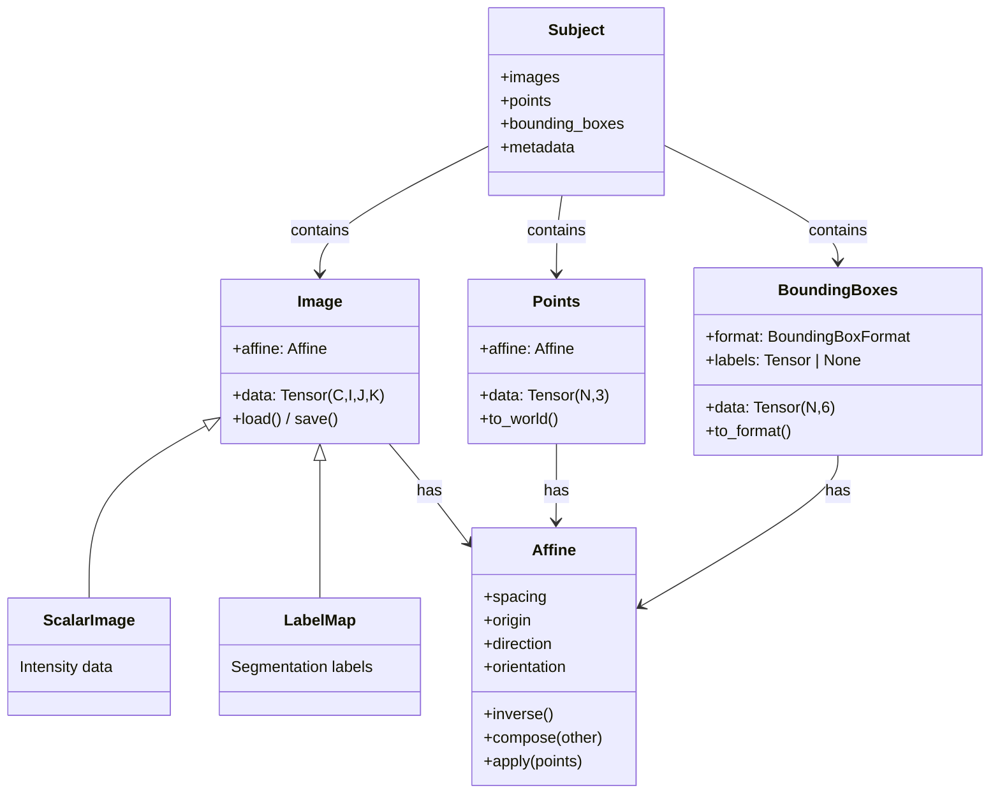
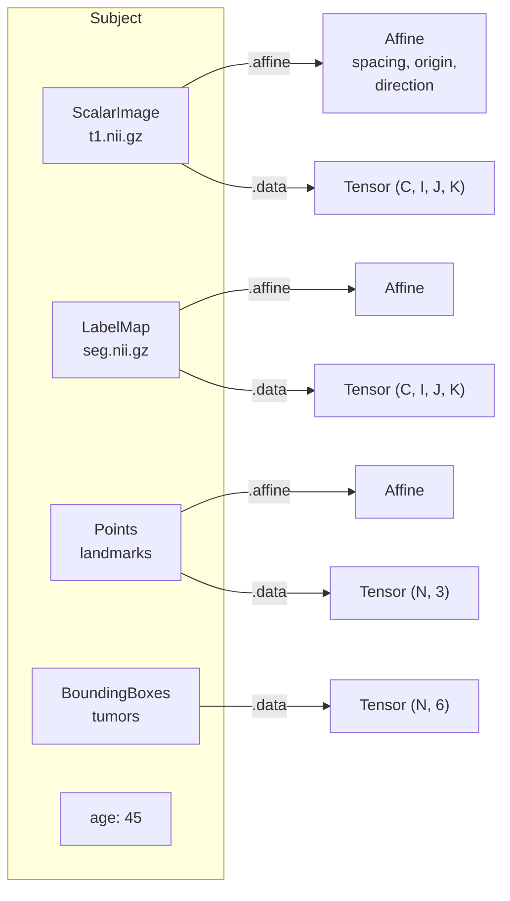

# Data model

TorchIO's data model has five core classes: **Image**, **Points**,
**BoundingBoxes**, **Subject**, and **Affine**. This article explains
what each one does and how they relate.

## Overview



## Image

An `Image` represents a single 3D (or multi-channel 3D) medical image.
It stores:

- A **4D tensor** with shape $(C, I, J, K)$ -- channels, then three
  spatial dimensions.
- An **affine matrix** mapping voxel indices $(i, j, k)$ to world
  coordinates $(x, y, z)$ in millimeters.
- Optional **metadata** (e.g., acquisition parameters).

Images are **lazy**: data is not read from disk until first accessed.
This means you can create thousands of `Image` objects cheaply and
only load what you need.

### ScalarImage vs LabelMap

`ScalarImage` and `LabelMap` are subclasses of `Image`. They carry no
extra data -- the distinction is purely semantic:

- **ScalarImage** -- continuous intensity data (MRI signal, CT
  Hounsfield units, PET SUV).
- **LabelMap** -- discrete segmentation labels (0 = background, 1 =
  tumor, etc.).

Transforms use `isinstance` checks to decide behavior. For example,
spatial transforms use linear interpolation for `ScalarImage` and
nearest-neighbor for `LabelMap`.

### Tensor layout

TorchIO uses the convention `(C, I, J, K)`:

| Axis | Meaning | Example |
|------|---------|---------|
| `C` | Channels | Gradient directions in DWI, components in a vector field |
| `I` | First spatial axis | Left-Right (in RAS) |
| `J` | Second spatial axis | Posterior-Anterior (in RAS) |
| `K` | Third spatial axis | Inferior-Superior (in RAS) |

Most single-channel images (T1, CT, etc.) have `C = 1`.

## Affine

The `Affine` class wraps a $4 \times 4$ matrix that maps voxel indices
to world coordinates:

$$
\begin{bmatrix} x \\ y \\ z \\ 1 \end{bmatrix}
=
\mathbf{A}
\begin{bmatrix} i \\ j \\ k \\ 1 \end{bmatrix}
$$

It provides named access to the components people usually care about:

- **`spacing`** -- voxel size in mm, derived from the column norms of
  the rotation-zoom block.
- **`origin`** -- world coordinates of the voxel at index $(0, 0, 0)$.
- **`direction`** -- $3 \times 3$ rotation matrix (spacing factored out).
- **`orientation`** -- anatomical axis codes like `('R', 'A', 'S')`.

Affines compose via the `@` operator:

```python
combined = affine_a @ affine_b
```

## Points

A `Points` object stores an $(N, 3)$ tensor of 3D coordinates in voxel
space, together with an affine for converting to world coordinates:

```python
import torch
import torchio as tio

landmarks = tio.Points(
    torch.tensor([[128.0, 100.0, 90.0], [128.0, 130.0, 90.0]]),
    affine=image.affine,
)
world = landmarks.to_world()  # (N, 3) in mm
```

Use cases include anatomical landmarks, fiducial markers, and seed
points.

## BoundingBoxes

`BoundingBoxes` stores an $(N, 6)$ tensor of 3D bounding boxes.
Inspired by `torchvision.tv_tensors.BoundingBoxes`, extended to three
dimensions. Two formats are supported:

The format is parameterised by **axes** and **representation**:

- **Axes**: any permutation of `IJK` (voxel) or any valid anatomical
  triplet like `RAS`, `LPI`, etc.
- **Representation**: *corners* (two opposite corners) or *center_size*
  (center + extent along each axis).

| Predefined | Axes | Representation |
|------------|------|----------------|
| `IJKIJK` | `IJK` | corners: $(i_1, j_1, k_1, i_2, j_2, k_2)$ |
| `IJKWHD` | `IJK` | center + size: $(i_c, j_c, k_c, s_i, s_j, s_k)$ |

Custom formats are created with
`BoundingBoxFormat("RAS", "corners")`, etc.

Convert between formats with `to_format()` — this handles
representation changes, axis permutations, and even voxel ↔ anatomical
conversions (using the stored affine). Optionally attach an integer
`labels` tensor to track per-box class IDs.

## Subject

A `Subject` groups images, points, bounding boxes, and metadata
belonging to one individual:

```python
subject = tio.Subject(
    t1=tio.ScalarImage("t1.nii.gz"),
    seg=tio.LabelMap("seg.nii.gz"),
    landmarks=tio.Points(torch.randn(5, 3)),
    tumors=tio.BoundingBoxes(
        torch.tensor([[10, 20, 30, 50, 60, 70]]),
        format=tio.BoundingBoxFormat.IJKIJK,
    ),
    age=45,
)
```

Contents are classified automatically by type:

- `Image` instances go to `subject.images()`
- `Points` instances go to `subject.points()`
- `BoundingBoxes` instances go to `subject.bounding_boxes()`
- Everything else is metadata, accessible via `subject.metadata`

All entries are accessible by name:

```python
subject.t1          # the ScalarImage
subject.landmarks   # the Points
subject.tumors      # the BoundingBoxes
subject.age         # 45
```

The `Subject` checks consistency across images -- for example,
`subject.spatial_shape` raises an error if the images have different
spatial shapes.

## How they fit together



A typical workflow:

1. Create `Image` objects from file paths (lazy, no data read).
2. Create `Points` or `BoundingBoxes` from annotations.
3. Group them into a `Subject`.
4. Apply transforms to the `Subject` -- this triggers loading and
   produces a new `Subject` with transformed data.
5. Access `.data` tensors for training.

## Batching with tensordict

When training a model, you need to stack subjects into batches.
TorchIO uses PyTorch's `tensordict` library for this:

```python
td = subject.to_tensordict()    # Subject → TensorDict
restored = Subject.from_tensordict(td)  # TensorDict → Subject
```

Under the hood:

- Image tensors and affines become regular tensor entries that stack
  efficiently.
- Points, bounding boxes, and metadata are stored as *non-tensor*
  entries -- these can have different sizes per subject (e.g.,
  different numbers of landmarks).

`SubjectsLoader` wraps `DataLoader` and performs this conversion
automatically:

```python
loader = tio.SubjectsLoader(dataset, batch_size=4)
for batch in loader:
    batch["t1", "data"]  # (4, C, I, J, K)
```
