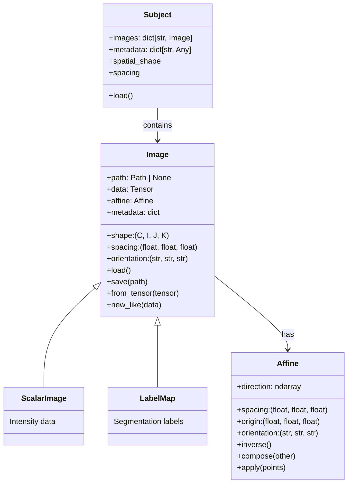
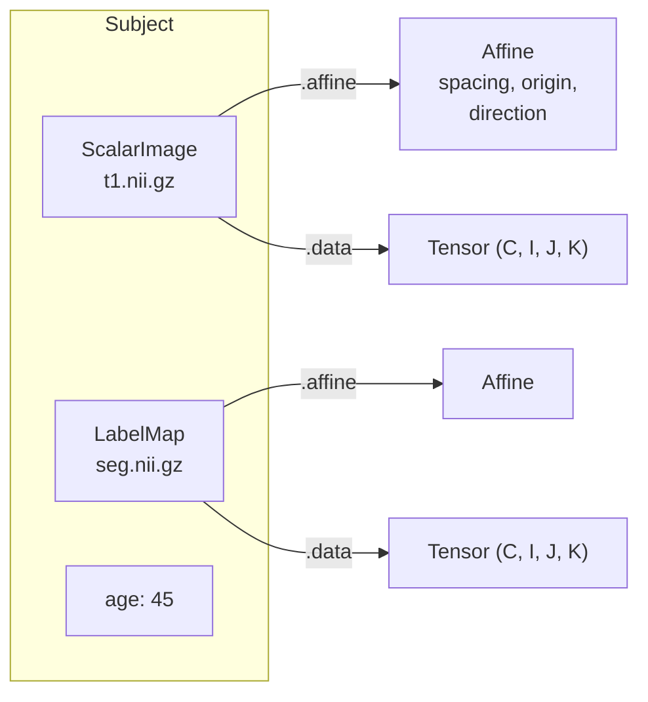

# Data model

TorchIO's data model has three core classes: **Image**, **Subject**, and
**Affine**. This article explains what each one does and how they
relate.

## Overview



## Image

An `Image` represents a single 3D (or multi-channel 3D) medical image.
It stores:

- A **4D tensor** with shape $(C, I, J, K)$ -- channels, then three
  spatial dimensions.
- An **affine matrix** mapping voxel indices $(i, j, k)$ to world
  coordinates $(x, y, z)$ in millimeters.
- Optional **metadata** (e.g., acquisition parameters).

Images are **lazy**: data is not read from disk until first accessed.
This means you can create thousands of `Image` objects cheaply and
only load what you need.

### ScalarImage vs LabelMap

`ScalarImage` and `LabelMap` are subclasses of `Image`. They carry no
extra data -- the distinction is purely semantic:

- **ScalarImage** -- continuous intensity data (MRI signal, CT
  Hounsfield units, PET SUV).
- **LabelMap** -- discrete segmentation labels (0 = background, 1 =
  tumor, etc.).

Transforms use `isinstance` checks to decide behavior. For example,
spatial transforms use linear interpolation for `ScalarImage` and
nearest-neighbor for `LabelMap`.

### Tensor layout

TorchIO uses the convention `(C, I, J, K)`:

| Axis | Meaning | Example |
|------|---------|---------|
| `C` | Channels | Gradient directions in DWI, components in a vector field |
| `I` | First spatial axis | Left-Right (in RAS) |
| `J` | Second spatial axis | Posterior-Anterior (in RAS) |
| `K` | Third spatial axis | Inferior-Superior (in RAS) |

Most single-channel images (T1, CT, etc.) have `C = 1`.

## Affine

The `Affine` class wraps a $4 \times 4$ matrix that maps voxel indices
to world coordinates:

$$
\begin{bmatrix} x \\ y \\ z \\ 1 \end{bmatrix}
=
\mathbf{A}
\begin{bmatrix} i \\ j \\ k \\ 1 \end{bmatrix}
$$

It provides named access to the components people usually care about:

- **`spacing`** -- voxel size in mm, derived from the column norms of
  the rotation-zoom block.
- **`origin`** -- world coordinates of the voxel at index $(0, 0, 0)$.
- **`direction`** -- $3 \times 3$ rotation matrix (spacing factored out).
- **`orientation`** -- anatomical axis codes like `('R', 'A', 'S')`.

Affines compose via the `@` operator:

```python
combined = affine_a @ affine_b
```

## Subject

A `Subject` groups images and metadata belonging to one individual:

```python
subject = tio.Subject(
    t1=tio.ScalarImage("t1.nii.gz"),
    seg=tio.LabelMap("seg.nii.gz"),
    age=45,
)
```

Everything that is an `Image` is stored as an image; everything else is
metadata. All entries are accessible by name:

```python
subject.t1     # the ScalarImage
subject.age    # 45
```

The `Subject` checks consistency across images -- for example,
`subject.spatial_shape` raises an error if the images have different
spatial shapes.

## How they fit together



A typical workflow:

1. Create `Image` objects from file paths (lazy, no data read).
2. Group them into a `Subject`.
3. Apply transforms to the `Subject` -- this triggers loading and
   produces a new `Subject` with transformed data.
4. Access `.data` tensors for training.
