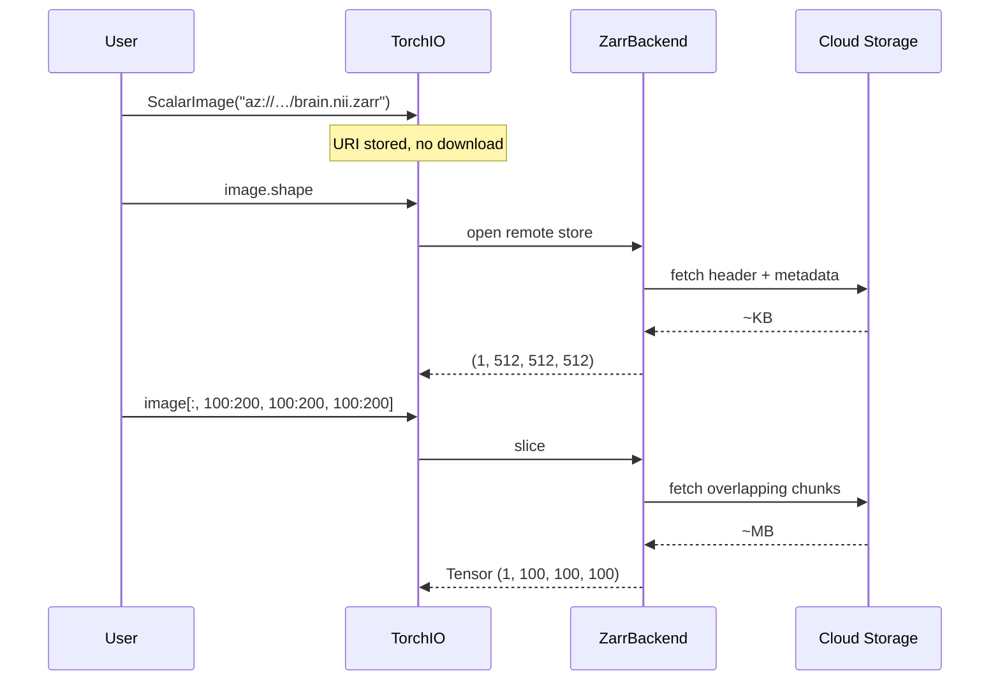

# Stream a remote NIfTI-Zarr

When a `.nii.zarr` volume lives on cloud storage (Azure Blob, S3, GCS),
TorchIO can open it **without downloading the entire file**. Only the
metadata and the chunks you actually read are fetched over the network.

This is especially useful for large volumes (e.g., 10 GB whole-brain
microscopy) where you only need a small region of interest.

## Prerequisites

Install TorchIO with the `zarr` extra and the storage backend you need:

=== "Azure Blob"

    ```
    pip install "torchio[zarr,azure]"
    ```

=== "S3"

    ```
    pip install "torchio[zarr,s3]"
    ```

=== "Google Cloud"

    ```
    pip install "torchio[zarr,gcs]"
    ```

## How it works



When you pass a remote `.nii.zarr` URI, TorchIO:

1. **Stores the URI** — no bytes are downloaded yet.
2. **On first metadata access** (`.shape`, `.affine`, …), opens a remote
   zarr store via [fsspec](https://filesystem-spec.readthedocs.io/) and
   reads only the header.
3. **On slicing**, fetches only the chunks that overlap with your region
   of interest.

## Authenticate to Azure and crop a region

<!-- pytest-codeblocks:skip -->
```python
import os

import torchio as tio

# Option 1: Authenticate via environment variables (recommended for CI/HPC).
# adlfs picks these up automatically.
os.environ["AZURE_STORAGE_ACCOUNT_NAME"] = "myaccount"
os.environ["AZURE_STORAGE_ACCOUNT_KEY"] = "my-secret-key"  # or use SAS, etc.

image = tio.ScalarImage("az://mycontainer/dataset/brain.nii.zarr")

# Nothing has been downloaded yet
print(image.shape)   # e.g. (1, 512, 512, 512) — only metadata fetched
print(image.spacing)  # from the NIfTI header stored in the zarr

# Crop a 100×100×100 ROI — only the overlapping chunks are fetched
roi = image[:, 200:300, 200:300, 200:300]
print(roi.shape)      # (1, 100, 100, 100)
print(roi.data.mean())
```

<!-- pytest-codeblocks:skip -->
```python
# Option 2: Pass credentials via reader_kwargs.
# These are forwarded to niizarr → zarr → fsspec → adlfs.
image = tio.ScalarImage(
    "az://mycontainer/dataset/brain.nii.zarr",
    reader_kwargs={"account_name": "myaccount", "account_key": "my-key"},
)

# Apply a TorchIO transform to the ROI
crop = tio.CropOrPad(128)
cropped = crop(roi)
print(cropped.shape)  # (1, 128, 128, 128)
```

!!! tip "Azure authentication methods"

    The `adlfs` library supports several authentication methods.
    Set the appropriate environment variables or pass them via
    `reader_kwargs`:

    | Method | Environment variables |
    |--------|-----------------------|
    | Account key | `AZURE_STORAGE_ACCOUNT_NAME`, `AZURE_STORAGE_ACCOUNT_KEY` |
    | SAS token | `AZURE_STORAGE_ACCOUNT_NAME`, `AZURE_STORAGE_SAS_TOKEN` |
    | Connection string | `AZURE_STORAGE_CONNECTION_STRING` |
    | Default credential (Azure CLI / Managed Identity) | `AZURE_STORAGE_ACCOUNT_NAME` |

    See the [adlfs documentation](https://github.com/fsspec/adlfs) for
    the full list.

## Other cloud providers

=== "S3"

    <!-- pytest-codeblocks:skip -->
    ```python
    image = tio.ScalarImage("s3://my-bucket/brain.nii.zarr")
    roi = image[:, 100:200, 100:200, 100:200]
    ```

    Authentication is handled by `s3fs`, which reads `~/.aws/credentials`
    or the `AWS_ACCESS_KEY_ID` / `AWS_SECRET_ACCESS_KEY` environment
    variables.

=== "Google Cloud"

    <!-- pytest-codeblocks:skip -->
    ```python
    image = tio.ScalarImage("gs://my-bucket/brain.nii.zarr")
    roi = image[:, 100:200, 100:200, 100:200]
    ```

    Authentication is handled by `gcsfs`, which uses Application Default
    Credentials or `GOOGLE_APPLICATION_CREDENTIALS`.

=== "HTTPS"

    <!-- pytest-codeblocks:skip -->
    ```python
    image = tio.ScalarImage("https://example.com/data/brain.nii.zarr")
    roi = image[:, 100:200, 100:200, 100:200]
    ```

    No extra packages needed — `fsspec[http]` is included by default.

## Comparison with non-Zarr remote files

For non-Zarr remote files (e.g., `az://…/brain.nii.gz`), TorchIO
downloads the **entire file** to a temporary local path before reading.
This is the expected behavior because formats like `.nii.gz` do not
support partial reads over the network.

| Source | What happens |
|--------|-------------|
| `az://…/brain.nii.gz` | Full download, then local read |
| `az://…/brain.nii.zarr` | **Streaming**: only metadata + requested chunks |

If you are working with large remote volumes, converting to `.nii.zarr`
first is strongly recommended. See [Save as NIfTI-Zarr](save-nii-zarr.md).
