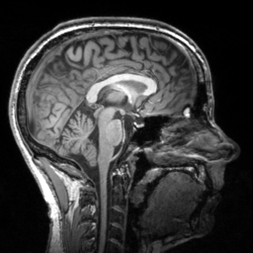

# Augmentation

Augmentation transforms generate different results every time they are called.

## Base class

::: torchio.transforms.augmentation.RandomTransform
    options:
      show_root_heading: true

## Composition

| Transform | Description |
|-----------|-------------|
| [`Compose`](Compose.md) | Compose several transforms together |
| [`OneOf`](OneOf.md) | Apply one of the given transforms |

## Spatial

| Transform | Description |
|-----------|-------------|
| [`RandomFlip`](RandomFlip.md) | Randomly reverse the order of elements in an image along the given axes |
| [`RandomAffine`](RandomAffine.md) | Apply a random affine transformation |
| [`RandomElasticDeformation`](RandomElasticDeformation.md) | Apply a random elastic deformation |
| [`RandomAffineElasticDeformation`](RandomAffineElasticDeformation.md) | Apply random affine and elastic deformation |
| [`RandomAnisotropy`](RandomAnisotropy.md) | Downsample an image along an axis and upsample back |

## Intensity

| Transform | Description |
|-----------|-------------|
| [`RandomMotion`](RandomMotion.md) | Simulate MRI motion artifacts |
| [`RandomGhosting`](RandomGhosting.md) | Simulate MRI ghosting artifacts |
| [`RandomSpike`](RandomSpike.md) | Simulate MRI spike artifacts |
| [`RandomBiasField`](RandomBiasField.md) | Simulate MRI bias field artifacts |
| [`RandomBlur`](RandomBlur.md) | Blur an image using a random-sized Gaussian filter |
| [`RandomNoise`](RandomNoise.md) | Add Gaussian noise |
| [`RandomSwap`](RandomSwap.md) | Randomly swap patches in an image |
| [`RandomLabelsToImage`](RandomLabelsToImage.md) | Generate an image from a segmentation |
| [`RandomGamma`](RandomGamma.md) | Randomly change contrast of an image |
