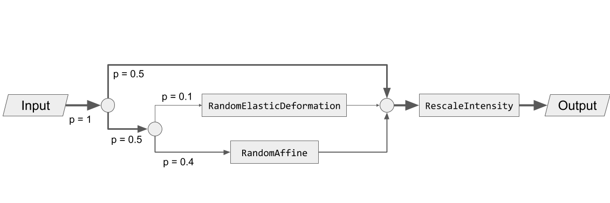

# Transforms


TorchIO transforms take as input instances of
[`Subject`][torchio.Subject] or
[`Image`][torchio.Image] (and its subclasses), 4D PyTorch tensors,
4D NumPy arrays, SimpleITK images, NiBabel images, or Python dictionaries
(see [`Transform`][torchio.transforms.Transform]).

For example:

```python
>>> import torch
>>> import numpy as np
>>> import torchio as tio
>>> affine_transform = tio.RandomAffine()
>>> tensor = torch.rand(1, 256, 256, 159)
>>> transformed_tensor = affine_transform(tensor)
>>> type(transformed_tensor)
<class 'torch.Tensor'>
>>> array = np.random.rand(1, 256, 256, 159)
>>> transformed_array = affine_transform(array)
>>> type(transformed_array)
<class 'numpy.ndarray'>
>>> subject = tio.datasets.Colin27()
>>> transformed_subject = affine_transform(subject)
>>> transformed_subject
Subject(Keys: ('t1', 'head', 'brain'); images: 3)
```

Transforms can also be applied from the command line using
`torchio-transform`.

All transforms inherit from [`Transform`][torchio.transforms.Transform]:

::: torchio.transforms.Transform
    options:
      members:
        - apply_transform
        - __call__

## Composability

Transforms can be composed to create directed acyclic graphs defining the
probability that each transform will be applied.

For example, to obtain the following graph:



We can type:

```python
>>> import torchio as tio
>>> spatial_transforms = {
...     tio.RandomElasticDeformation(): 0.2,
...     tio.RandomAffine(): 0.8,
... }
>>> transform = tio.Compose([
...     tio.OneOf(spatial_transforms, p=0.5),
...     tio.RescaleIntensity(out_min_max=(0, 1)),
... ])
```

## Interoperability with MONAI

[MONAI](https://monai.io/) dictionary transforms can be used inside TorchIO
pipelines via [`MonaiAdapter`][torchio.transforms.MonaiAdapter]. The adapter
handles conversion between TorchIO's [`Subject`][torchio.Subject] and MONAI's
expected dictionary format, including affine propagation for spatial transforms.

```python
>>> import torchio as tio
>>> from monai.transforms import NormalizeIntensityd, RandSpatialCropd
>>> pipeline = tio.Compose([
...     tio.ToCanonical(),
...     tio.MonaiAdapter(NormalizeIntensityd(keys=["t1"])),
...     tio.RandomFlip(),
...     tio.MonaiAdapter(
...         RandSpatialCropd(keys=["t1", "seg"], roi_size=[64, 64, 64]),
...     ),
... ])
```

## Reproducibility

When transforms are instantiated, we typically need to pass values that will be
used to sample the transform parameters when the
[`__call__`][torchio.transforms.Transform.__call__] method of the transform is
called, i.e., when the transform instance is called.

All random transforms have a corresponding deterministic class, that can be
applied again to obtain exactly the same result.
The [`Subject`][torchio.Subject] class contains some convenient methods to
reproduce transforms:

```python
>>> import torchio as tio
>>> subject = tio.datasets.FPG()
>>> transforms = (
...     tio.CropOrPad((100, 200, 300)),
...     tio.RandomFlip(axes=['LR', 'AP', 'IS']),
...     tio.OneOf([tio.RandomAnisotropy(), tio.RandomElasticDeformation()]),
... )
>>> transform = tio.Compose(transforms)
>>> transformed = transform(subject)
>>> reproduce_transform = transformed.get_composed_history()
>>> reproduced = reproduce_transform(subject)
```

## Invertibility

Inverting transforms can be especially useful in scenarios in which one needs
to apply some transformation, infer a segmentation on the transformed data and
apply the inverse transform to the inference in order to bring it back to the
original space.

This is particularly useful, for example, for
[test-time augmentation](https://www.nature.com/articles/s41598-020-61808-3)
or [aleatoric uncertainty estimation](https://www.sciencedirect.com/science/article/pii/S0925231219301961):

```python
>>> import torchio as tio
>>> # Mock a segmentation CNN
>>> def model(x):
...     return x
...
>>> subject = tio.datasets.Colin27()
>>> transform = tio.RandomAffine()
>>> segmentations = []
>>> num_segmentations = 10
>>> for _ in range(num_segmentations):
...     transform = tio.RandomAffine(image_interpolation='bspline')
...     transformed = transform(subject)
...     segmentation = model(transformed)
...     transformed_native_space = segmentation.apply_inverse_transform(image_interpolation='linear')
...     segmentations.append(transformed_native_space)
...
```

Transforms can be classified in three types, according to their degree of
invertibility:

- **Lossless**: transforms that can be inverted with no loss of information,
  such as [`RandomFlip`][torchio.transforms.RandomFlip],
  [`Pad`][torchio.transforms.Pad],
  or [`RandomNoise`][torchio.transforms.RandomNoise].

- **Lossy**: transforms that can be inverted with some loss of information, such
  as [`RandomAffine`][torchio.transforms.RandomAffine],
  or [`Crop`][torchio.transforms.Crop].

- **Impossible**: transforms that cannot be inverted, such as
  [`RandomBlur`][torchio.transforms.RandomBlur].

Non-invertible transforms will be ignored by the
[`apply_inverse_transform`][torchio.Subject.apply_inverse_transform] method of
[`Subject`][torchio.Subject].

## Interpolation

Some transforms such as
[`RandomAffine`][torchio.transforms.RandomAffine] or
[`RandomMotion`][torchio.transforms.RandomMotion]
need to interpolate intensity values during resampling.

The available interpolation strategies can be inferred from the elements of
[`Interpolation`][torchio.transforms.interpolation.Interpolation].

`'linear'` interpolation, the default in TorchIO for scalar images,
is usually a good compromise between image quality and speed.
It is therefore a good choice for data augmentation during training.

Methods such as `'bspline'` or `'lanczos'` generate
high-quality results, but are generally slower. They can be used to obtain
optimal resampling results during offline data preprocessing.

`'nearest'` can be used for quick experimentation as it is very
fast, but produces relatively poor results for scalar images.
It is the default interpolation type for label maps, as categorical values for
the different labels need to preserved after interpolation.

When instantiating transforms, it is possible to specify independently the
interpolation type for label maps and scalar images, as shown in the
documentation for, e.g., [`Resample`][torchio.transforms.Resample].

Visit the
[SimpleITK docs](https://simpleitk.org/doxygen/latest/html/namespaceitk_1_1simple.html#a7cb1ef8bd02c669c02ea2f9f5aa374e5)
for technical documentation and
[Cambridge in Colour](https://www.cambridgeincolour.com/tutorials/image-interpolation.htm)
for some further general explanations of digital image interpolation.

::: torchio.transforms.interpolation.Interpolation
    options:
      members: true
      show_root_heading: true
