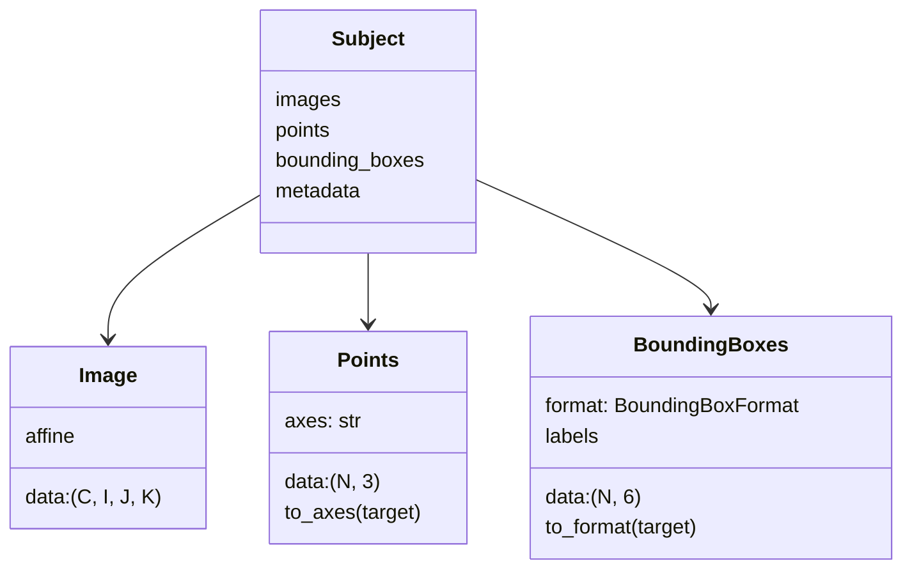

# Working with annotations

This tutorial introduces `Points` and `BoundingBoxes`, two data
structures for storing spatial annotations alongside medical images.

## Prerequisites

```
uv add torchio
```

## Why annotations?

Medical image analysis often involves more than just voxel intensities.
You might need to track:

- **Anatomical landmarks** (fiducial points placed by a clinician)
- **Lesion detections** (bounding boxes from a detection model)
- **Seed points** for region growing algorithms

TorchIO's `Points` and `BoundingBoxes` classes keep these annotations
together with the images they refer to, inside a single `Subject`.

## Step 1: Create some points

```python
import torch
import torchio as tio

# Three landmarks in voxel coordinates (IJK)
landmarks = tio.Points(
    torch.tensor([
        [64.0, 64.0, 32.0],
        [100.0, 80.0, 50.0],
        [30.0, 120.0, 45.0],
    ]),
)
print(landmarks)           # Points(num_points=3, axes='IJK')
print(landmarks.num_points)  # 3
print(landmarks.axes)        # 'IJK'
```

Points are stored as an $(N, 3)$ tensor:

<!-- pytest-codeblocks:cont -->
```python
print(landmarks.data.shape)  # torch.Size([3, 3])
```

## Step 2: Convert between axis conventions

Points default to `IJK` (voxel indices). Convert to any other
convention:

<!-- pytest-codeblocks:cont -->
```python
# With identity affine, IJK == RAS numerically
ras = landmarks.to_axes("RAS")
print(ras.axes)  # 'RAS'

# Or get world coordinates directly
world = landmarks.to_world()
```

When the points come from a real image, pass its affine:

<!-- pytest-codeblocks:skip -->
```python
image = tio.ScalarImage("t1.nii.gz")
landmarks = tio.Points(
    torch.tensor([[64.0, 64.0, 32.0]]),
    affine=image.affine,
)
ras = landmarks.to_axes("RAS")  # now in mm
```

Supported axis conventions:

| Type | Examples |
|------|----------|
| Voxel | `IJK`, `KJI`, `JIK`, ... (any permutation) |
| Anatomical | `RAS`, `LPI`, `AIR`, ... (one from each pair {R,L}, {A,P}, {S,I}) |

## Step 3: Create bounding boxes

Bounding boxes are 6-element vectors. The format is defined by axes
and representation:

| Predefined | Meaning |
|------------|---------|
| `IJKIJK` | Corners: $(i_1, j_1, k_1, i_2, j_2, k_2)$ |
| `IJKWHD` | Center + size: $(i_c, j_c, k_c, s_i, s_j, s_k)$ |

<!-- pytest-codeblocks:skip -->
```python
boxes = tio.BoundingBoxes(
    torch.tensor([
        [10, 20, 30, 50, 60, 70],
        [80, 90, 40, 120, 130, 80],
    ]),
    format=tio.BoundingBoxFormat.IJKIJK,
)
print(boxes)           # BoundingBoxes(num_boxes=2, ...)
print(boxes.num_boxes)  # 2
```

Convert between formats:

<!-- pytest-codeblocks:skip -->
```python
whd = boxes.to_format(tio.BoundingBoxFormat.IJKWHD)
print(whd.data[0])  # center=(30, 40, 50), size=(40, 40, 40)
```

Custom formats work too:

<!-- pytest-codeblocks:skip -->
```python
from torchio import BoundingBoxFormat

ras_corners = BoundingBoxFormat("RAS", "corners")
ras_boxes = boxes.to_format(ras_corners)
```

## Step 4: Attach labels

Each box can carry a class label:

<!-- pytest-codeblocks:skip -->
```python
boxes = tio.BoundingBoxes(
    torch.tensor([[10, 20, 30, 50, 60, 70]]),
    format=tio.BoundingBoxFormat.IJKIJK,
    labels=torch.tensor([1]),
)
print(boxes.labels)  # tensor([1])
```

## Step 5: Build a Subject with everything

A `Subject` automatically sorts its contents:

<!-- pytest-codeblocks:skip -->
```python
subject = tio.Subject(
    t1=tio.ScalarImage.from_tensor(torch.randn(1, 64, 64, 64)),
    seg=tio.LabelMap.from_tensor((torch.randn(1, 64, 64, 64) > 0).float()),
    landmarks=landmarks,
    tumors=boxes,
    age=45,
)
```

Access each type:

<!-- pytest-codeblocks:skip -->
```python
subject.t1          # Image
subject.landmarks   # Points
subject.tumors      # BoundingBoxes
subject.age         # metadata (45)
```

Inspect what the Subject contains:

<!-- pytest-codeblocks:skip -->
```python
print(subject)
# Subject(images: ('t1', 'seg'); points: ('landmarks',); bboxes: ('tumors',))
```

List all entries of a given type:

<!-- pytest-codeblocks:skip -->
```python
subject.images()          # {'t1': ..., 'seg': ...}
subject.points()          # {'landmarks': ...}
subject.bounding_boxes()  # {'tumors': ...}
```

## Summary



You now know how to:

- Store landmark coordinates with `Points`
- Define regions of interest with `BoundingBoxes`
- Convert between axis conventions (`IJK`, `RAS`, `LPI`, etc.)
- Attach labels to bounding boxes
- Group everything in a `Subject`
