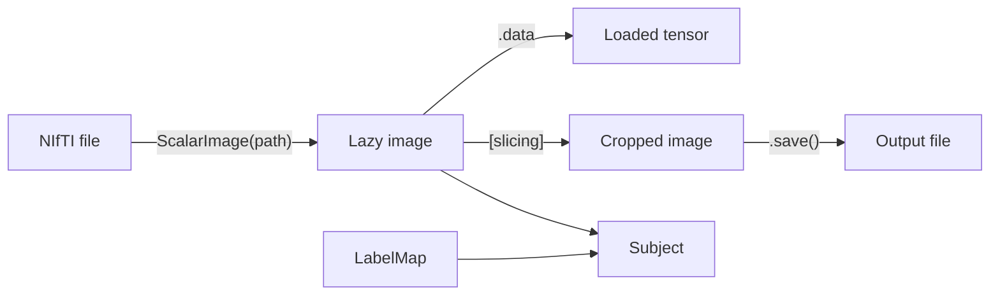

# Your first pipeline

This tutorial walks you through loading medical images, grouping them
into a Subject, and saving results. By the end you will understand
the core data structures.

## Prerequisites

```
uv add torchio
```

You need at least one NIfTI file. If you do not have one, create a
synthetic image:

```python
import torch
import torchio as tio

image = tio.ScalarImage(torch.randn(1, 64, 64, 64))
image.save("/tmp/synthetic.nii.gz")
```

## Step 1: Load an image

```python
import torchio as tio

t1 = tio.ScalarImage("/tmp/synthetic.nii.gz")
```

At this point, **no data has been read from disk**. TorchIO uses lazy
loading. The file is only read when you access `.data`, `.spacing`,
or apply a transform.

<!-- pytest-codeblocks:cont -->
```python
print(t1.shape)      # (1, 64, 64, 64), reads only the header
print(t1.is_loaded)  # False
print(t1.spacing)    # (1.0, 1.0, 1.0)
```

## Step 2: Access the data

<!-- pytest-codeblocks:cont -->
```python
tensor = t1.data  # triggers the load
print(t1.is_loaded)  # True
print(tensor.shape)  # torch.Size([1, 64, 64, 64])
print(tensor.dtype)  # torch.float32
```

The data tensor has shape `(C, I, J, K)` where `C` is the number of
channels and `I, J, K` are the spatial dimensions.

## Step 3: Create a Subject

A `Subject` groups related images, annotations, and metadata:

<!-- pytest-codeblocks:cont -->
```python
import torch

seg_tensor = (torch.randn(1, 64, 64, 64) > 0).float()
seg = tio.LabelMap(seg_tensor)

subject = tio.Subject(
    t1=t1,
    seg=seg,
    age=30,
)
```

Access images and metadata by name:

<!-- pytest-codeblocks:cont -->
```python
subject.t1          # the ScalarImage
subject.seg         # the LabelMap
subject.age         # 30
subject.spatial_shape  # (64, 64, 64), checked across all images
```

!!! tip "Annotations"

    You can also add `Points` and `BoundingBoxes` to a Subject.
    See the [annotations tutorial](annotations.md) for details.

## Step 4: Slice a region

<!-- pytest-codeblocks:cont -->
```python
patch = subject.t1[:, 10:30, 10:30, 10:30]
print(patch.shape)   # (1, 20, 20, 20)
print(patch.origin)  # shifted by 10 voxels in each direction
```

## Step 5: Save the result

<!-- pytest-codeblocks:cont -->
```python
patch.save("/tmp/patch.nii.gz")
```

## Summary



You now know how to:

- Load images lazily with `ScalarImage` and `LabelMap`
- Group them into a `Subject`
- Slice regions without loading the full volume
- Save results to disk
