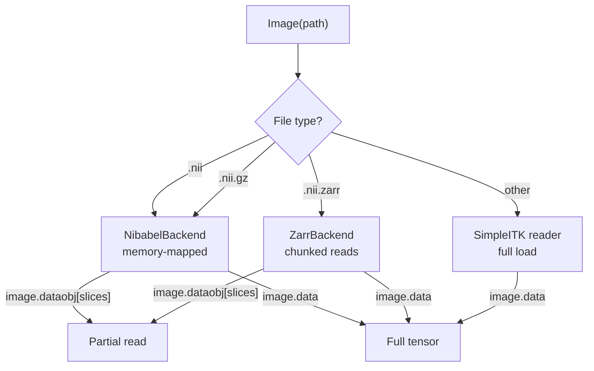

# Working with large volumes

Medical images can be very large. A single high-resolution MRI might
occupy several gigabytes. This tutorial shows how to work with such
volumes efficiently using TorchIO's lazy loading and backend system.

## The problem

Loading a 724 x 868 x 724 float32 volume takes ~45 seconds and
allocates 1.8 GB of RAM. If you only need a small region, that is
wasteful.

## Lazy slicing

TorchIO images are lazy by default. Slicing a lazy image reads **only
the requested region** through the backend, without loading the full
volume into memory:

```python
import torchio as tio

image = tio.ScalarImage("huge_volume.nii.gz")

# This is fast -- reads only a 10x10x10 patch
patch = image[:, 100:110, 100:110, 100:110]
print(patch.data.mean())

# The original image was never fully loaded
print(image.is_loaded)  # False
```

On a 724 x 868 x 724 volume, this takes ~0.1 seconds instead of ~45.

## File format comparison

Not all formats are equally efficient for partial reads:

| Format | Extension | Partial I/O | Notes |
|--------|-----------|------------|-------|
| Uncompressed NIfTI | `.nii` | Memory-mapped | Best for local random access |
| Compressed NIfTI | `.nii.gz` | Buffered by nibabel | Fast for small regions, but gzip has no true random access |
| NIfTI-Zarr | `.nii.zarr` | Chunked reads | Best for very large volumes and remote storage |

## NIfTI-Zarr

NIfTI-Zarr stores data in independently compressed chunks. Reading one
chunk does not require decompressing any other. This is ideal for:

- Volumes too large to fit in memory
- Remote storage (S3, GCS) where you want to fetch only what you need
- Collaborative workflows where different users need different regions

### Converting to NIfTI-Zarr

```python
image = tio.ScalarImage("volume.nii.gz")
image.save("volume.nii.zarr")
```

### Reading from NIfTI-Zarr

```python
image = tio.ScalarImage("volume.nii.zarr")
print(image.shape)  # reads only metadata

# Read a small region -- only the overlapping chunks are decompressed
patch = image[:, 50:60, 50:60, 50:60]
```

!!! note

    NIfTI-Zarr support requires the `zarr` extra:

    ```
    uv add torchio --extra zarr
    ```

## The backend system

TorchIO uses a pluggable backend system to support different storage
formats:



- **`image.data`** -- materializes the full tensor (triggers load if needed)
- **`image.dataobj`** -- returns the lazy backend for advanced slicing
- **`image[slices]`** -- uses the backend automatically, returns a new image

## Tips

1. **Use uncompressed `.nii` for local training** -- memory-mapping gives
   true random access with zero decompression cost.
2. **Use `.nii.zarr` for large shared volumes** -- chunked storage means
   each worker reads only what it needs.
3. **Avoid `.nii.gz` for random access** -- gzip is a stream format.
   Nibabel handles it well for small slices, but for repeated random
   access, convert to `.nii` or `.nii.zarr`.
4. **Slice before loading** -- `image[:, 100:200].data` is much cheaper
   than `image.data[:, 100:200]`.
